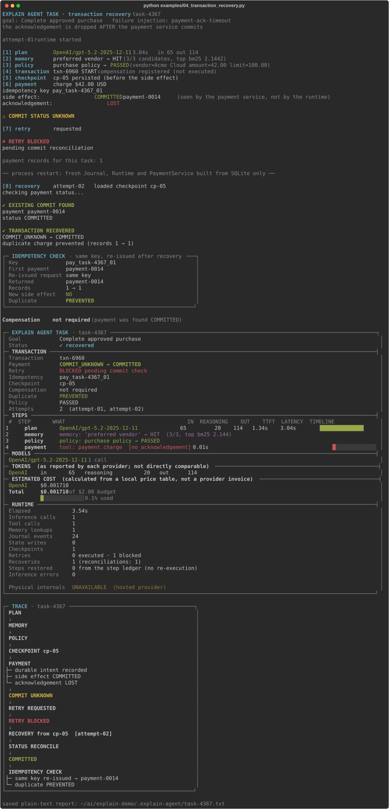
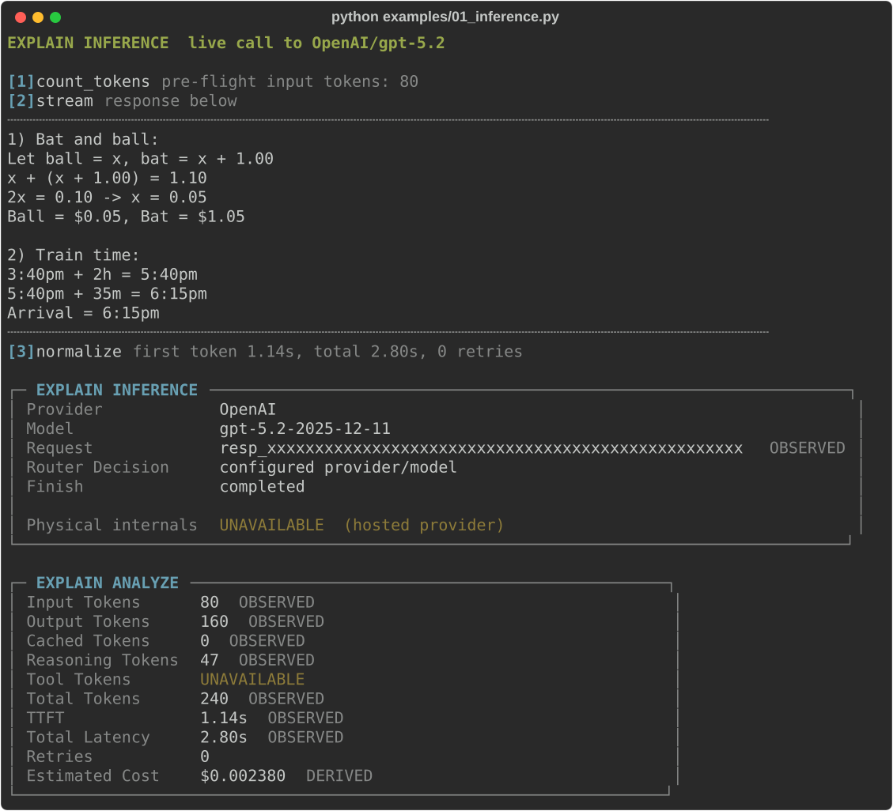
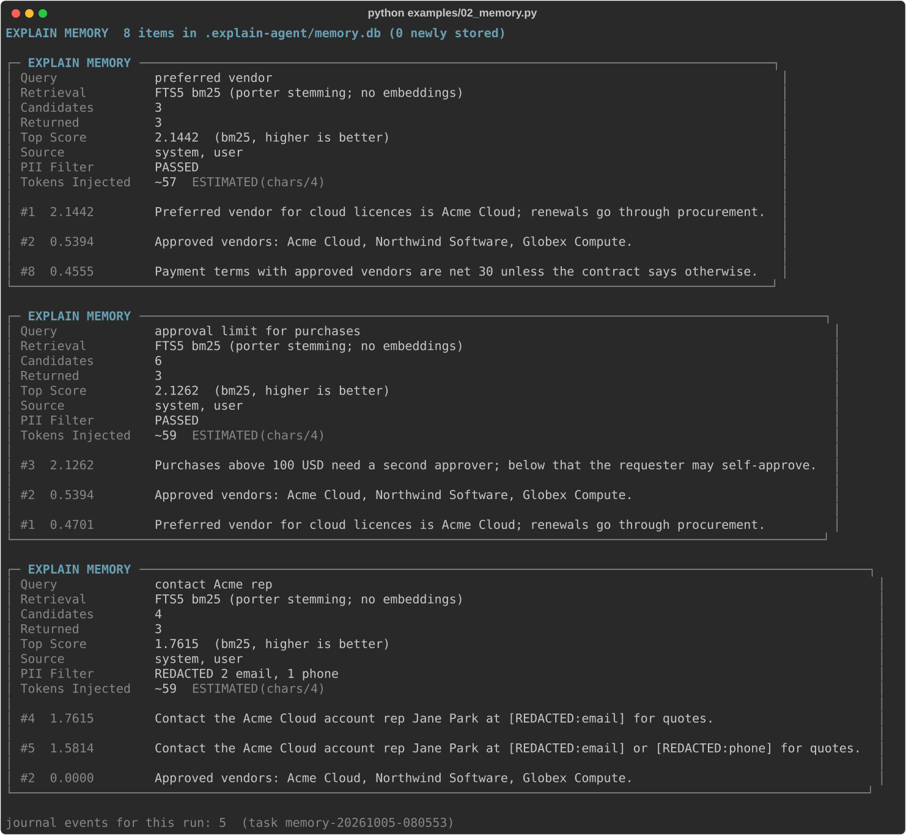
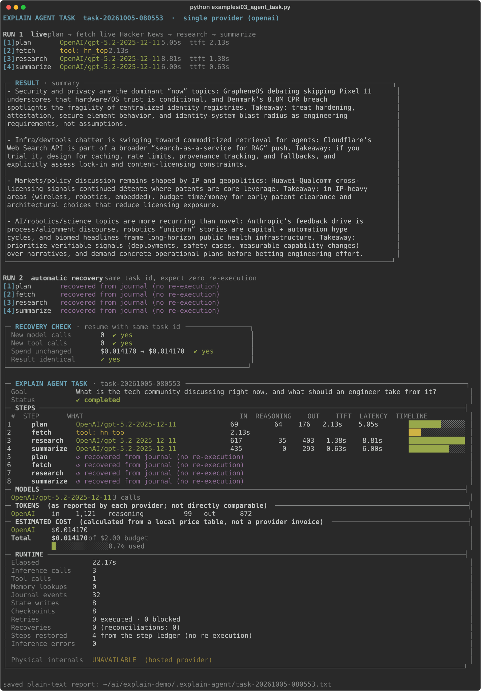
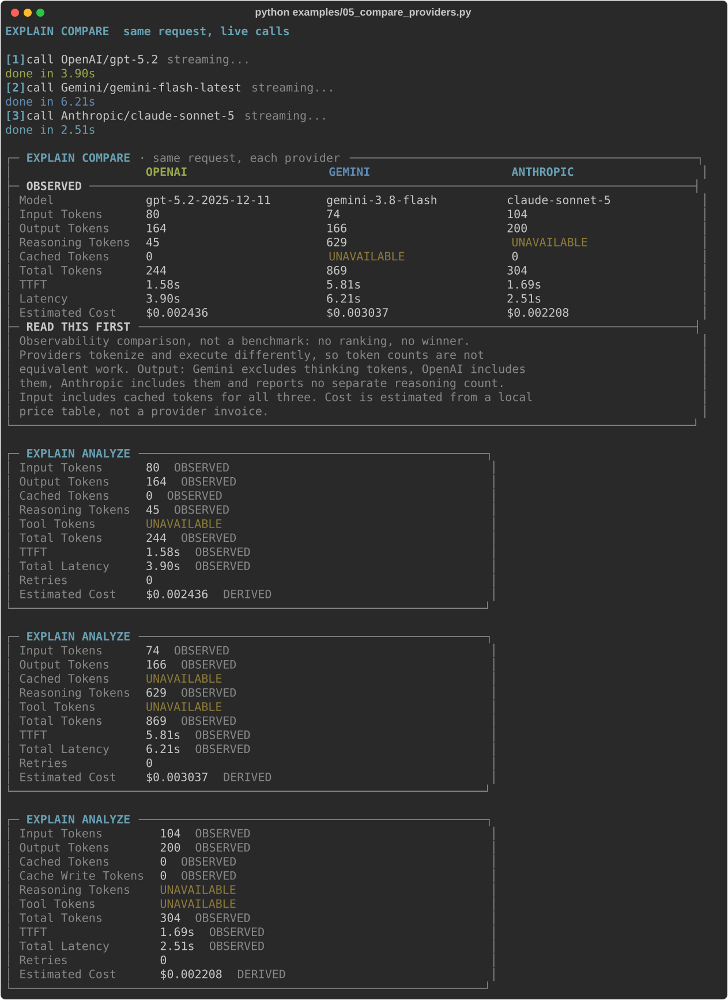
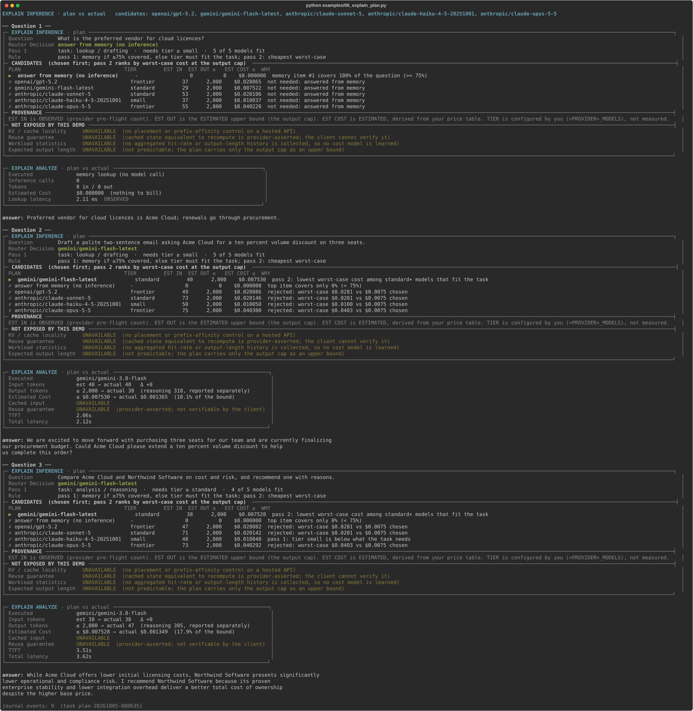
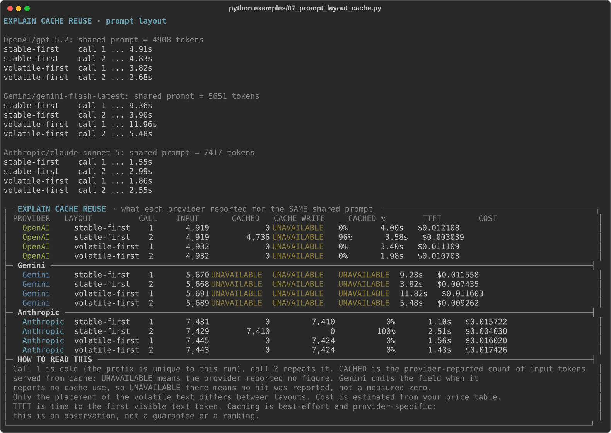
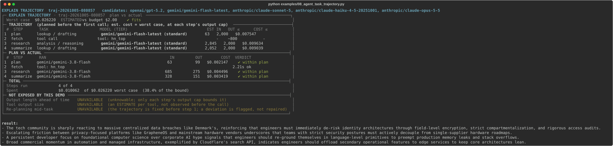

# EXPLAIN for AI Agents

> **Proof of concept, for demonstration only.** This repository is a demo built to illustrate the ideas in
> the articles below. It is **not** a real or production implementation: the payment service is a local
> stand-in that moves no money, the transaction manager is a teaching sketch, and nothing here should be
> used to run real workloads. See [Limitations](#limitations).

Databases gave us `EXPLAIN` and `EXPLAIN ANALYZE`.

LLM runtimes need **EXPLAIN INFERENCE**.

Agent runtimes need **EXPLAIN AGENT TASK**.

This repository is a live reference implementation that projects real LLM, tool, memory,
state and transaction execution into SQL-like EXPLAIN views. It makes real calls to
**OpenAI**, **Gemini** and **Anthropic**, and every box below is captured output from a real run.

```
EXPLAIN INFERENCE
    Why did the runtime choose this execution plan?

EXPLAIN ANALYZE
    What actually happened?

EXPLAIN AGENT TASK
    How did the complete task execute across models, memory, tools, state,
    transactions, retries, checkpoints, authority, cost and time?
```

## Example output

Each example below shows a screenshot of its real, coloured terminal output. Click one, or open **[docs/EXAMPLES.md](docs/EXAMPLES.md)**, for all of them with copyable plain text.

## Companion code for *Database Kernels for AI*

This is the reference implementation for **[Your AI Agent Needs a Transaction Manager](https://anuganti.com/articles/ai-agent-needs-transaction-manager/)**,
part of the *Database Kernels for AI* series at **[anuganti.com/articles](https://anuganti.com/articles)**.
The article makes the argument; this repository lets you watch it happen against live models. The article
links to the rest of the series.

Examples 02, 03 and 04 are the demos for the article (memory, agent tasks, and the ambiguous-commit recovery
demo). Examples 01 and 05 to 07 show the inference observability those tasks sit on.

## Quickstart

```bash
python3 -m venv .venv && source .venv/bin/activate
pip install -r requirements.txt
cp .env.example .env          # fill in keys and models; .env is git-ignored
EXPLAIN_PROVIDER=openai python examples/01_inference.py
python examples/04_transaction_recovery.py
```

**No API keys?** Replay a recorded run. The files in `samples/` are real journals captured from live runs;
the views are rendered from their events, with no keys and no network:

```bash
python -m explain replay samples/04_transaction_recovery.json    # the hero demo below
python -m explain replay samples/03_agent_task.json
```

Configuration comes from `.env` **or** ordinary shell variables (the shell wins). Keys are only
ever read from the environment. Models are never hard-coded: set the one you want to observe.

| Variable | Meaning |
|---|---|
| `EXPLAIN_PROVIDER` | `openai`, `gemini` or `anthropic` |
| `OPENAI_API_KEY`, `OPENAI_MODELS` | required for OpenAI |
| `GEMINI_API_KEY`, `GEMINI_MODELS` | required for Gemini |
| `ANTHROPIC_API_KEY`, `ANTHROPIC_MODELS` | required for Anthropic |
| `*_MODELS` format | comma list, each with an optional tier: `gpt-x-mini:small,gpt-x:frontier` (`small` \| `standard` \| `frontier`, default `standard`); a single model is just `gpt-x`. Example 06 plans across all of them; other examples use the first. |
| `REASONING_EFFORT` | one setting for every provider: `minimal`/`low`/`medium`/`high`. OpenAI `reasoning.effort`, Gemini `thinking_level`, Anthropic `output_config.effort`. Blank = provider default |
| `EXPLAIN_AGENT_DB` | task/transaction journal, default `.explain-agent/runtime.db` |
| `EXPLAIN_PAYMENTS_DB`, `EXPLAIN_MEMORY_DB` | the local payment service and agent memory: separate SQLite files on purpose |
| `EXPLAIN_AGENT_BUDGET_USD` | per-task spend cap, default `2.00` |
| `*_PRICE_INPUT_PER_M`, `*_PRICE_OUTPUT_PER_M`, `*_PRICE_CACHED_PER_M` | optional price override, USD per 1M tokens; normally unnecessary, prices come from `data/cost.json` or auto-fetch (see Cost). Needs a single model in `*_MODELS`. |

## The hero demo: an ambiguous commit

> A timeout does not mean an external action failed.
> The action may have committed while only the acknowledgement was lost.

```
payment committed
      ↓
acknowledgement lost
      ↓
COMMIT UNKNOWN
      ↓
retry blocked
      ↓
status reconciled
      ↓
original commit recovered
```

The runtime does not blindly retry an ambiguous side effect. It records durable intent, uses a
stable idempotency key, blocks retry while commit status is unknown, reconciles against the
external system, and resumes from durable execution state.

```bash
python examples/04_transaction_recovery.py
```

What really happens: a live model writes the plan; a local `PaymentService` (its **own SQLite file**,
`UNIQUE` idempotency key) commits the charge; the acknowledgement is dropped **after** that commit
by a deterministic failure injector; the runtime moves to `COMMIT_UNKNOWN` and **refuses** the
retry in code (not in the formatter); a fresh runtime rebuilt from SQLite alone reconciles with the
payment service and finds the original payment; re-issuing the same key creates nothing.

[](docs/EXAMPLES.md#4-transaction-failure-and-recovery)

<sub>Real output from a live run (run log, EXPLAIN AGENT TASK projection, trajectory trace); click for copyable text.</sub>

The projection is read back from recorded events, and its counters agree with the trace: the retry was requested and
**blocked** (none executed), and one recovery ran. You can also regenerate it without keys:
`python -m explain replay samples/04_transaction_recovery.json`.

Other scenarios: `--phase fail` ends the process after the failure and `--recover <task-id>` finishes it
from a **new process**; `--compensate` adds a later policy rejection that triggers a recorded,
at-most-once compensation; `--fail none` runs the happy path.

## Architecture

```
REAL EXECUTION
      ↓
APPEND-ONLY EVENTS
      ↓
DURABLE TASK / TRANSACTION JOURNAL
      ↓
EXPLAIN PROJECTION
      ↓
HUMAN-READABLE PLAN / RUNTIME / TRAJECTORY
```

EXPLAIN is not a logging formatter. The boxes are projections over recorded execution state:
`project_task()` turns journal events into a plain dict, and the terminal view only renders that dict.
The event vocabulary is closed (`explain/events.py`); the journal rejects unknown event types. Tests
rebuild the view from a fresh SQLite connection to prove nothing comes from Python memory.

```
               EXPLAIN AGENT TASK
                       │
     ┌──────────┬──────┴─────┬───────────────┐
  Memory      Tools      Inference      Transactions
 (FTS5)     (events)        │            (journal +
                      ┌─────┼──────┐     payment svc)
                   OpenAI Gemini Anthropic
```

Agent **memory** (semantic lookups, `memory.db`) is not the **journal** (execution events, `runtime.db`).
Execution persistence is reported as *journal events* and *state writes*; "memory" is only ever a real memory lookup.

## Examples

### 1. EXPLAIN INFERENCE: `examples/01_inference.py`

```bash
EXPLAIN_PROVIDER=gemini python examples/01_inference.py     # or openai, anthropic
```

[](docs/EXAMPLES.md#1-explain-inference)

<sub>Real output from a live run; click for copyable text.</sub>

Every value is tagged by how it is known: `OBSERVED` (reported by the provider or measured by the client),
`DERIVED` (calculated from observed values) or `ESTIMATED`. Hosted APIs do not expose GPU placement, KV
occupancy, graph breaks or kernel fusion, so they collapse to one `Physical internals UNAVAILABLE` line; they
are never invented, and they expand into individual rows for any adapter that really exposes them.

### 2. EXPLAIN MEMORY: `examples/02_memory.py`

Real persistent memory in SQLite FTS5. Retrieval is lexical (bm25), so there are no embedding similarity
scores to show, and none are shown. No model is called.

[](docs/EXAMPLES.md#2-explain-memory)

<sub>Real output from a live run; click for copyable text.</sub>

### 3. EXPLAIN AGENT TASK, a normal live task: `examples/03_agent_task.py`

Plan, fetch live Hacker News, research, summarize, on any provider (or mixed with
`--multi-provider` / `--roles planner=gemini,research=openai,summarizer=anthropic`). It then **automatically
re-runs the same task id** to show recovery; completed steps are restored from the journal, not re-executed.

[](docs/EXAMPLES.md#3-explain-agent-task-a-normal-live-task)

<sub>Real output from a live run; click for copyable text.</sub>

### 4. Transaction failure and recovery: `examples/04_transaction_recovery.py`

The hero demo above.

### 5. Multi-provider observability: `examples/05_compare_providers.py`

The same request against every configured provider. An advanced example showing the EXPLAIN layer is
provider-neutral, not a benchmark.

[](docs/EXAMPLES.md#5-multi-provider-observability)

<sub>Real output from a live run; click for copyable text.</sub>

**Observability comparison, not a benchmark. No ranking, no winner.** Providers tokenize and execute
differently, so token counts are not equivalent units of work. Output: Gemini excludes thinking tokens,
OpenAI includes them, Anthropic includes them and reports no separate reasoning count (so it shows
`UNAVAILABLE`). Input includes cached tokens for all three.

### 6. The plan, then the actuals: `examples/06_explain_plan.py`

The plan is two-pass. **Pass 1** builds the feasible set from the task (memory if it covers the question, else models
whose tier fits: a drafting task fits any tier, analysis needs `standard`+, code or multi-step needs `frontier`). **Pass 2**
costs only that set.

Hosted APIs hide physical placement, but the decisions the *runtime* makes are real: answer from memory instead
of inferring, which configured model to call, and what that should cost. The plan is a real decision over
observed inputs (memory coverage, each provider's own pre-flight token count, your price table), journaled as a
`PLAN_CHOSEN` event; the view is rendered from that event, then compared with what actually happened.

```bash
python examples/06_explain_plan.py
```

[](docs/EXAMPLES.md#6-the-plan-then-the-actuals)

<sub>Real output from a live run; click for copyable text.</sub>

The first question is answered from memory, so no model is called. The second picks the candidate with the
lowest *worst-case* estimated cost and shows each rejected alternative with the numbers that rejected it. The
estimate is an upper bound, not a prediction: Gemini's reasoning tokens are reported separately from its output.

### 7. Prompt layout and cache reuse: `examples/07_prompt_layout_cache.py`

Providers only reuse a cached prefix when the prompt is large enough **and** its start is byte-identical between
calls. This sends the same ~5-7k token handbook two ways, twice each: stable text first (only the question
varies) versus a per-request header first. Each run's prefix is unique, so call 1 is genuinely cold.

```bash
python examples/07_prompt_layout_cache.py
```

[](docs/EXAMPLES.md#7-prompt-layout-and-cache-reuse)

<sub>Real output from a live run; click for copyable text.</sub>

In this run, with the stable-first layout OpenAI reported 96% of the input as cached on the warm repeat, and
Anthropic read back everything it had written on call 1. With the volatile header first, neither reported any reuse.
Gemini reported no cached-token figure in either layout (the field is absent when no cache use is reported, so
that is not a measured zero). The same prompt is 4.9k, 5.7k and 7.4k tokens depending on the provider's
tokenizer. Caching is best-effort and provider-specific; this is one run's observation, not a guarantee.

### 8. Agent task trajectory: `examples/08_agent_task_trajectory.py`

The same task as example 03 (plan, fetch live Hacker News, research, summarize), but the whole trajectory is planned
**before the first call**. Each model step goes through the two passes of example 06: pass 1 keeps the models whose tier
fits that step (planning and summarizing fit a `small` model, the research analysis needs `standard`+), pass 2 takes the
cheapest worst case. A later step's input estimate carries an allowance for upstream output, and the summed worst case
must fit `EXPLAIN_AGENT_BUDGET_USD` or the task is rejected without running. After the run, EXPLAIN TRAJECTORY shows
planned vs actual per step and flags deviations (input above the estimate, a different model, cost above the bound).

```bash
python examples/08_agent_task_trajectory.py
python -m explain trajectory <task-id>     # re-render from the journal
```

The trajectory is fixed up front: a deviation is flagged, not repaired (no mid-task re-planning), and tool output size
and output length are estimates or caps, shown as such. 

[](docs/EXAMPLES.md#8-agent-task-trajectory)

<sub>Real output from a live run; click for copyable text.</sub>

## Inspecting a task

```bash
python -m explain list
python -m explain explain <task-id>     # EXPLAIN AGENT TASK
python -m explain trace   <task-id>     # trajectory
python -m explain trajectory <task-id>  # planned vs actual (examples/08)
python -m explain events  <task-id>     # event journal as a table (add --json for developers)
python -m explain export  <task-id> --out samples/mine.json   # record a run (secrets already redacted)
python -m explain replay  samples/mine.json                   # render it again: no keys, no network
```

## Cost

Cost is **estimated**: calculated from a local price table, not a provider invoice. Lookup order:
`*_PRICE_*` env override, then `data/cost.json`, then auto-fetch. No provider API exposes prices, so
auto-fetch reads the community-maintained LiteLLM price table and saves the entry with its source and
timestamp (check the provider's pricing page before quoting). Disable with `EXPLAIN_PRICE_AUTOFETCH=0`.
Unknown pricing renders `UNAVAILABLE`, never zero. Cache-write tokens are billed at the input rate here;
tiered or long-context pricing is not modelled.

## Safety

Before anything is persisted or printed, API keys, bearer tokens, `Authorization`/cookie values and the
values of any configured `*KEY/*TOKEN/*SECRET` environment variable are redacted. Tool arguments are stored
as summaries (long strings shortened, collections reduced to their size), and the environment is never
stored. A test writes a fake key through every persistence path and scans the raw SQLite bytes.

## Limitations

- This is a **proof of concept for demonstration**, not a real or production implementation, and not a production transaction manager.
- Arbitrary external tools do **not** participate in ACID transactions.
- **Compensation is not rollback**: it is a new, recorded action that reverses an effect. Handlers must be idempotent.
- Hosted model APIs do not expose all physical inference internals. GPU placement, KV occupancy, graph breaks
  and kernel fusion therefore remain `UNAVAILABLE` where the provider does not expose them.
- Cost is calculated from a local pricing table; treat it as estimated, not provider-billed.
- Provider token accounting differs; see the comparison note.
- Cache results (example 07) are single-run observations; providers cache on a best-effort basis and report it differently.
- The plan (example 06) is two explicit rules over observed inputs, not a cost-based optimizer. Pass 1 (keyword rules
  against tiers *you* assign in `*_MODELS`) decides which models are feasible; correctness is a constraint there, never
  traded against cost. Pass 2 ranks the feasible set by worst-case cost, an upper bound rather than a prediction. Pass 1
  can say "no feasible plan" instead of silently downgrading.
- KV/cache locality, a reuse-equivalence guarantee, workload statistics and expected output length are shown as `UNAVAILABLE`
  in the plan: a hosted API exposes none of them, and they are not invented.
- Distributed state is not implemented: no replication, sync, conflict resolution, placement or distributed forgetting.
- The payment service is local and demonstrates external side-effect semantics. It does not process real money.
- `SIDE_EFFECT_COMMITTED` is reported out-of-band by the payment service's observer after its own commit.
  The runtime never uses it for decisions; its state follows only what its acknowledgement says.
- Refusal fallbacks for Anthropic models are not enabled in this demo; a refusal surfaces as the finish reason.

## Layout

```
explain/
  schema.py  events.py  redact.py  config.py  pricing.py
  providers/{base,openai,gemini,anthropic}.py    one InferenceProvider interface
  journal.py        append-only events + durable tables (SQLite)
  agent.py          provider-independent runtime: durable steps, tools, memory lookups, policy
  transaction.py    durable intent, COMMIT_UNKNOWN, retry block, reconciliation, compensation
  plan.py           two-pass inference plan (feasible set, then cost): chosen path + rejected alternatives (PLAN_CHOSEN)
  trajectory.py     whole-task plan before running + plan-vs-actual view (TRAJECTORY_PLANNED)
  payments.py       local external payment service (separate SQLite, UNIQUE idempotency key)
  memory.py         agent memory (FTS5), separate from the journal
  explain_task.py   EXPLAIN AGENT TASK projection      trace.py   trajectory projection
  render.py         EXPLAIN INFERENCE / ANALYZE / MEMORY / COMPARE    cli.py   explain|trace|events
examples/  01_inference  02_memory  03_agent_task  04_transaction_recovery  05_compare_providers
           06_explain_plan  07_prompt_layout_cache  08_agent_task_trajectory
samples/   recorded real journals for keyless replay
tests/     behavior tests (no keys needed): idempotency, commit-unknown, reconciliation,
           checkpoint recovery, compensation, journal projection, capabilities, redaction,
           plan choice, prompt-layout prefix stability, replay
```

`python -m pytest -q` needs no API keys. The live behaviour is exercised by the examples.
