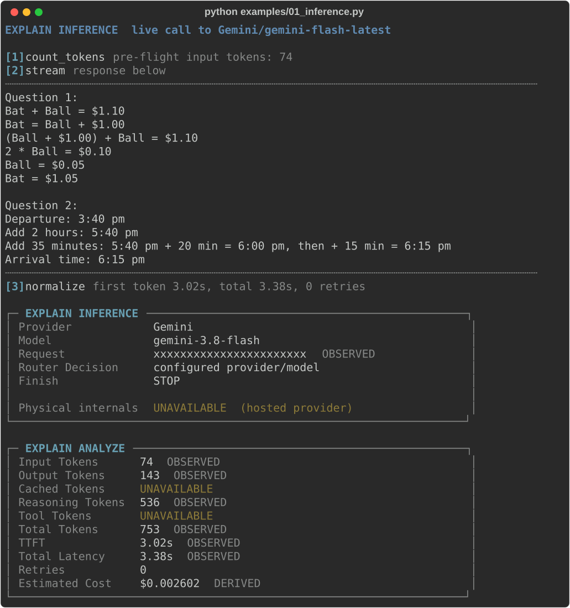
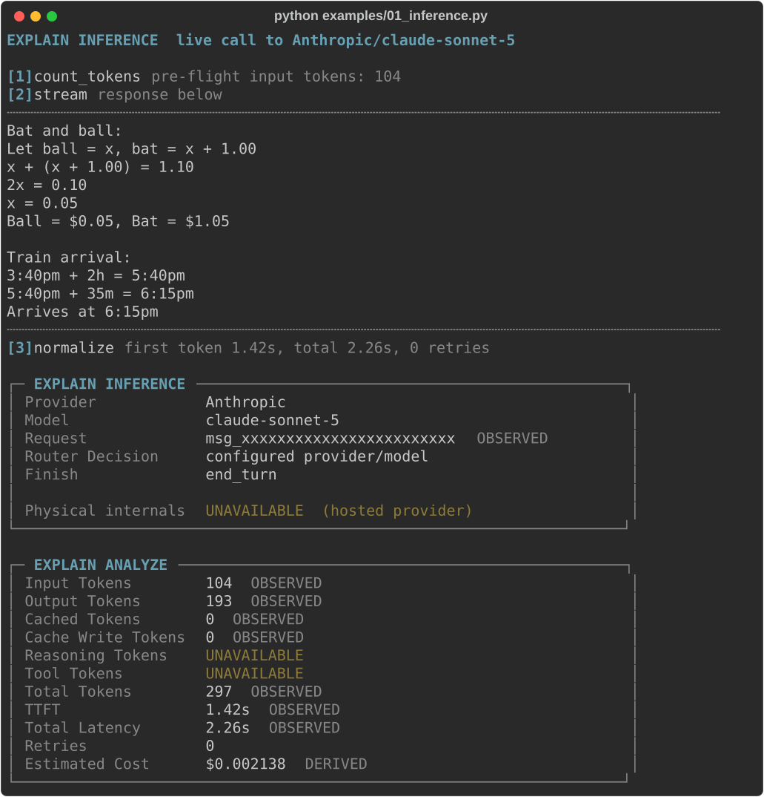

# Example output

Real output from live runs of every example, captured by `scripts/capture_examples.py`. Nothing is edited except masking the home directory. Each run is a screenshot of the coloured terminal output (SVG) with the plain text underneath it, for copying. Models, token counts, latencies and costs vary run to run.

Part of the [README](../README.md). To regenerate: `python scripts/capture_examples.py` (`python scripts/capture_examples.py 06 08` re-captures only those).

## 1. EXPLAIN INFERENCE

`python examples/01_inference.py`

**openai**


<details><summary>plain text</summary>

```text
EXPLAIN INFERENCE  live call to OpenAI/gpt-5.2 

[1] count_tokens  pre-flight input tokens: 80
[2] stream  response below
  ┄┄┄┄┄┄┄┄┄┄┄┄┄┄┄┄┄┄┄┄┄┄┄┄┄┄┄┄┄┄┄┄┄┄┄┄┄┄┄┄┄┄┄┄┄┄┄┄┄┄┄┄┄┄┄┄┄┄┄┄┄┄┄┄┄┄┄┄┄┄┄┄┄┄┄┄┄┄┄┄
1) Bat and ball:
Let ball = x, bat = x + 1.00
x + (x + 1.00) = 1.10
2x = 0.10 -> x = 0.05
Ball = $0.05, Bat = $1.05

2) Train time:
3:40pm + 2h = 5:40pm
5:40pm + 35m = 6:15pm
Arrival = 6:15pm
  ┄┄┄┄┄┄┄┄┄┄┄┄┄┄┄┄┄┄┄┄┄┄┄┄┄┄┄┄┄┄┄┄┄┄┄┄┄┄┄┄┄┄┄┄┄┄┄┄┄┄┄┄┄┄┄┄┄┄┄┄┄┄┄┄┄┄┄┄┄┄┄┄┄┄┄┄┄┄┄┄
[3] normalize  first token 1.14s, total 2.80s, 0 retries 

┌─ EXPLAIN INFERENCE ───────────────────────────────────────────────────────────────────┐
│ Provider            OpenAI                                                            │
│ Model               gpt-5.2-2025-12-11                                                │
│ Request             resp_xxxxxxxxxxxxxxxxxxxxxxxxxxxxxxxxxxxxxxxxxxxxxxxxxx  OBSERVED │
│ Router Decision     configured provider/model                                         │
│ Finish              completed                                                         │
│                                                                                       │
│ Physical internals  UNAVAILABLE  (hosted provider)                                    │
└───────────────────────────────────────────────────────────────────────────────────────┘ 

┌─ EXPLAIN ANALYZE ──────────────────────────────────────────────────┐
│ Input Tokens      80  OBSERVED                                     │
│ Output Tokens     160  OBSERVED                                    │
│ Cached Tokens     0  OBSERVED                                      │
│ Reasoning Tokens  47  OBSERVED                                     │
│ Tool Tokens       UNAVAILABLE                                      │
│ Total Tokens      240  OBSERVED                                    │
│ TTFT              1.14s  OBSERVED                                  │
│ Total Latency     2.80s  OBSERVED                                  │
│ Retries           0                                                │
│ Estimated Cost    $0.002380  DERIVED                               │
└────────────────────────────────────────────────────────────────────┘
```

</details>

**gemini**



<details><summary>plain text</summary>

```text
EXPLAIN INFERENCE  live call to Gemini/gemini-flash-latest 

[1] count_tokens  pre-flight input tokens: 74
[2] stream  response below
  ┄┄┄┄┄┄┄┄┄┄┄┄┄┄┄┄┄┄┄┄┄┄┄┄┄┄┄┄┄┄┄┄┄┄┄┄┄┄┄┄┄┄┄┄┄┄┄┄┄┄┄┄┄┄┄┄┄┄┄┄┄┄┄┄┄┄┄┄┄┄┄┄┄┄┄┄┄┄┄┄
Question 1:
Bat + Ball = $1.10
Bat = Ball + $1.00
(Ball + $1.00) + Ball = $1.10
2 * Ball = $0.10
Ball = $0.05
Bat = $1.05

Question 2:
Departure: 3:40 pm
Add 2 hours: 5:40 pm
Add 35 minutes: 5:40 pm + 20 min = 6:00 pm, then + 15 min = 6:15 pm
Arrival time: 6:15 pm
  ┄┄┄┄┄┄┄┄┄┄┄┄┄┄┄┄┄┄┄┄┄┄┄┄┄┄┄┄┄┄┄┄┄┄┄┄┄┄┄┄┄┄┄┄┄┄┄┄┄┄┄┄┄┄┄┄┄┄┄┄┄┄┄┄┄┄┄┄┄┄┄┄┄┄┄┄┄┄┄┄
[3] normalize  first token 3.02s, total 3.38s, 0 retries 

┌─ EXPLAIN INFERENCE ────────────────────────────────────────────────┐
│ Provider            Gemini                                         │
│ Model               gemini-3.8-flash                               │
│ Request             xxxxxxxxxxxxxxxxxxxxxxx  OBSERVED              │
│ Router Decision     configured provider/model                      │
│ Finish              STOP                                           │
│                                                                    │
│ Physical internals  UNAVAILABLE  (hosted provider)                 │
└────────────────────────────────────────────────────────────────────┘ 

┌─ EXPLAIN ANALYZE ──────────────────────────────────────────────────┐
│ Input Tokens      74  OBSERVED                                     │
│ Output Tokens     143  OBSERVED                                    │
│ Cached Tokens     UNAVAILABLE                                      │
│ Reasoning Tokens  536  OBSERVED                                    │
│ Tool Tokens       UNAVAILABLE                                      │
│ Total Tokens      753  OBSERVED                                    │
│ TTFT              3.02s  OBSERVED                                  │
│ Total Latency     3.38s  OBSERVED                                  │
│ Retries           0                                                │
│ Estimated Cost    $0.002602  DERIVED                               │
└────────────────────────────────────────────────────────────────────┘
```

</details>

**anthropic**



<details><summary>plain text</summary>

```text
EXPLAIN INFERENCE  live call to Anthropic/claude-sonnet-5 

[1] count_tokens  pre-flight input tokens: 104
[2] stream  response below
  ┄┄┄┄┄┄┄┄┄┄┄┄┄┄┄┄┄┄┄┄┄┄┄┄┄┄┄┄┄┄┄┄┄┄┄┄┄┄┄┄┄┄┄┄┄┄┄┄┄┄┄┄┄┄┄┄┄┄┄┄┄┄┄┄┄┄┄┄┄┄┄┄┄┄┄┄┄┄┄┄
Bat and ball:
Let ball = x, bat = x + 1.00
x + (x + 1.00) = 1.10
2x = 0.10
x = 0.05
Ball = $0.05, Bat = $1.05

Train arrival:
3:40pm + 2h = 5:40pm
5:40pm + 35m = 6:15pm
Arrives at 6:15pm
  ┄┄┄┄┄┄┄┄┄┄┄┄┄┄┄┄┄┄┄┄┄┄┄┄┄┄┄┄┄┄┄┄┄┄┄┄┄┄┄┄┄┄┄┄┄┄┄┄┄┄┄┄┄┄┄┄┄┄┄┄┄┄┄┄┄┄┄┄┄┄┄┄┄┄┄┄┄┄┄┄
[3] normalize  first token 1.42s, total 2.26s, 0 retries 

┌─ EXPLAIN INFERENCE ────────────────────────────────────────────────┐
│ Provider            Anthropic                                      │
│ Model               claude-sonnet-5                                │
│ Request             msg_xxxxxxxxxxxxxxxxxxxxxxxx  OBSERVED         │
│ Router Decision     configured provider/model                      │
│ Finish              end_turn                                       │
│                                                                    │
│ Physical internals  UNAVAILABLE  (hosted provider)                 │
└────────────────────────────────────────────────────────────────────┘ 

┌─ EXPLAIN ANALYZE ──────────────────────────────────────────────────┐
│ Input Tokens        104  OBSERVED                                  │
│ Output Tokens       193  OBSERVED                                  │
│ Cached Tokens       0  OBSERVED                                    │
│ Cache Write Tokens  0  OBSERVED                                    │
│ Reasoning Tokens    UNAVAILABLE                                    │
│ Tool Tokens         UNAVAILABLE                                    │
│ Total Tokens        297  OBSERVED                                  │
│ TTFT                1.42s  OBSERVED                                │
│ Total Latency       2.26s  OBSERVED                                │
│ Retries             0                                              │
│ Estimated Cost      $0.002138  DERIVED                             │
└────────────────────────────────────────────────────────────────────┘
```

</details>

## 2. EXPLAIN MEMORY

`python examples/02_memory.py`


<details><summary>plain text</summary>

```text
EXPLAIN MEMORY  8 items in .explain-agent/memory.db (0 newly stored) 

┌─ EXPLAIN MEMORY ──────────────────────────────────────────────────────────────────────────────────────┐
│ Query             preferred vendor                                                                    │
│ Retrieval         FTS5 bm25 (porter stemming; no embeddings)                                          │
│ Candidates        3                                                                                   │
│ Returned          3                                                                                   │
│ Top Score         2.1442  (bm25, higher is better)                                                    │
│ Source            system, user                                                                        │
│ PII Filter        PASSED                                                                              │
│ Tokens Injected   ~57  ESTIMATED (chars/4)                                                            │
│                                                                                                       │
│   #1  2.1442      Preferred vendor for cloud licences is Acme Cloud; renewals go through procurement. │
│                                                                                                       │
│   #2  0.5394      Approved vendors: Acme Cloud, Northwind Software, Globex Compute.                   │
│                                                                                                       │
│   #8  0.4555      Payment terms with approved vendors are net 30 unless the contract says otherwise.  │
└───────────────────────────────────────────────────────────────────────────────────────────────────────┘ 

┌─ EXPLAIN MEMORY ─────────────────────────────────────────────────────────────────────────────────────────────┐
│ Query             approval limit for purchases                                                               │
│ Retrieval         FTS5 bm25 (porter stemming; no embeddings)                                                 │
│ Candidates        6                                                                                          │
│ Returned          3                                                                                          │
│ Top Score         2.1262  (bm25, higher is better)                                                           │
│ Source            system, user                                                                               │
│ PII Filter        PASSED                                                                                     │
│ Tokens Injected   ~59  ESTIMATED (chars/4)                                                                   │
│                                                                                                              │
│   #3  2.1262      Purchases above 100 USD need a second approver; below that the requester may self-approve. │
│                                                                                                              │
│   #2  0.5394      Approved vendors: Acme Cloud, Northwind Software, Globex Compute.                          │
│                                                                                                              │
│   #1  0.4701      Preferred vendor for cloud licences is Acme Cloud; renewals go through procurement.        │
└──────────────────────────────────────────────────────────────────────────────────────────────────────────────┘ 

┌─ EXPLAIN MEMORY ───────────────────────────────────────────────────────────────────────────────────────────────────┐
│ Query             contact Acme rep                                                                                 │
│ Retrieval         FTS5 bm25 (porter stemming; no embeddings)                                                       │
│ Candidates        4                                                                                                │
│ Returned          3                                                                                                │
│ Top Score         1.7615  (bm25, higher is better)                                                                 │
│ Source            system, user                                                                                     │
│ PII Filter        REDACTED 2 email, 1 phone                                                                        │
│ Tokens Injected   ~59  ESTIMATED (chars/4)                                                                         │
│                                                                                                                    │
│   #4  1.7615      Contact the Acme Cloud account rep Jane Park at [REDACTED:email] for quotes.                     │
│                                                                                                                    │
│   #5  1.5814      Contact the Acme Cloud account rep Jane Park at [REDACTED:email] or [REDACTED:phone] for quotes. │
│                                                                                                                    │
│   #2  0.0000      Approved vendors: Acme Cloud, Northwind Software, Globex Compute.                                │
└────────────────────────────────────────────────────────────────────────────────────────────────────────────────────┘ 

journal events for this run: 5  (task memory-20261005-080553)
```

</details>

## 3. EXPLAIN AGENT TASK, a normal live task

`python examples/03_agent_task.py`


<details><summary>plain text</summary>

```text
EXPLAIN AGENT TASK  task-20261005-080553  ·  single provider (openai)

RUN 1  live  plan → fetch live Hacker News → research → summarize
[1] plan      OpenAI/gpt-5.2-2025-12-11  5.05s  ttft 2.13s
[2] fetch     tool: hn_top  2.13s
[3] research  OpenAI/gpt-5.2-2025-12-11  8.81s  ttft 1.38s
[4] summarize OpenAI/gpt-5.2-2025-12-11  6.00s  ttft 0.63s

┌─ RESULT · summary ─────────────────────────────────────────────────────────────────────────────┐
│ - Security and privacy are the dominant “now” topics: GrapheneOS debating skipping Pixel 11    │
│   underscores that hardware/OS trust is conditional, and Denmark’s 8.8M CPR breach             │
│   spotlights the fragility of centralized identity registries. Takeaway: treat hardening,      │
│   attestation, secure element behavior, and identity-system blast radius as engineering        │
│   requirements, not assumptions.                                                               │
│                                                                                                │
│ - Infra/devtools chatter is swinging toward commoditized retrieval for agents: Cloudflare’s    │
│   Web Search API is part of a broader “search-as-a-service for RAG” push. Takeaway: if you     │
│   trial it, design for caching, rate limits, provenance tracking, and fallbacks, and           │
│   explicitly assess lock-in and content-licensing constraints.                                 │
│                                                                                                │
│ - Markets/policy discussion remains shaped by IP and geopolitics: Huawei–Qualcomm cross-       │
│   licensing signals continued détente where patents are core leverage. Takeaway: in IP-heavy   │
│   areas (wireless, robotics, embedded), budget time/money for early patent clearance and       │
│   architectural choices that reduce licensing exposure.                                        │
│                                                                                                │
│ - AI/robotics/science topics are more recurring than novel: Anthropic’s feedback drive is      │
│   process/alignment discourse, robotics “unicorn” stories are capital + automation hype        │
│   cycles, and biomed headlines frame long-horizon public health infrastructure. Takeaway:      │
│   prioritize verifiable signals (deployments, safety cases, measurable capability changes)     │
│   over narratives, and demand concrete operational plans before betting engineering effort.    │
└────────────────────────────────────────────────────────────────────────────────────────────────┘

RUN 2  automatic recovery  same task id, expect zero re-execution
[1] plan      recovered from journal (no re-execution)
[2] fetch     recovered from journal (no re-execution)
[3] research  recovered from journal (no re-execution)
[4] summarize recovered from journal (no re-execution)

┌─ RECOVERY CHECK · resume with same task id ────────────────┐
│ New model calls       0  ✔ yes                             │
│ New tool calls        0  ✔ yes                             │
│ Spend unchanged       $0.014170 → $0.014170  ✔ yes         │
│ Result identical      ✔ yes                                │
└────────────────────────────────────────────────────────────┘

┌─ EXPLAIN AGENT TASK · task-20261005-080553 ──────────────────────────────────────────────────────────────────────┐
│ Goal            What is the tech community discussing right now, and what should an engineer take from it?       │
│ Status          ✔ completed                                                                                      │
├─ STEPS ──────────────────────────────────────────────────────────────────────────────────────────────────────────┤
│   #  STEP       WHAT                                       IN  REASONING    OUT    TTFT  LATENCY  TIMELINE       │
│   1  plan       OpenAI/gpt-5.2-2025-12-11                  69         64    176   2.13s    5.05s  ████████░░░░░░ │
│   2  fetch      tool: hn_top                                                               2.13s  ███░░░░░░░░░░░ │
│   3  research   OpenAI/gpt-5.2-2025-12-11                 617         35    403   1.38s    8.81s  ██████████████ │
│   4  summarize  OpenAI/gpt-5.2-2025-12-11                 435          0    293   0.63s    6.00s  ██████████░░░░ │
│   5  plan       ↺ recovered from journal (no re-execution)                                                       │
│   6  fetch      ↺ recovered from journal (no re-execution)                                                       │
│   7  research   ↺ recovered from journal (no re-execution)                                                       │
│   8  summarize  ↺ recovered from journal (no re-execution)                                                       │
├─ MODELS ─────────────────────────────────────────────────────────────────────────────────────────────────────────┤
│ OpenAI/gpt-5.2-2025-12-11   3 calls                                                                              │
├─ TOKENS  (as reported by each provider; not directly comparable) ────────────────────────────────────────────────┤
│ OpenAI    in    1,121   reasoning          99   out      872                                                     │
├─ ESTIMATED COST  (calculated from a local price table, not a provider invoice) ──────────────────────────────────┤
│ OpenAI    $0.014170                                                                                              │
│ Total     $0.014170   of $2.00 budget                                                                            │
│           █░░░░░░░░░░░░░ 0.7% used                                                                               │
├─ RUNTIME ────────────────────────────────────────────────────────────────────────────────────────────────────────┤
│ Elapsed             22.17s                                                                                       │
│ Inference calls     3                                                                                            │
│ Tool calls          1                                                                                            │
│ Memory lookups      0                                                                                            │
│ Journal events      32                                                                                           │
│ State writes        8                                                                                            │
│ Checkpoints         8                                                                                            │
│ Retries             0 executed · 0 blocked                                                                       │
│ Recoveries          0 (reconciliations: 0)                                                                       │
│ Steps restored      4 from the step ledger (no re-execution)                                                     │
│ Inference errors    0                                                                                            │
│                                                                                                                  │
│ Physical internals  UNAVAILABLE  (hosted provider)                                                               │
└──────────────────────────────────────────────────────────────────────────────────────────────────────────────────┘

saved plain-text report: ~/ai/explain-demo/.explain-agent/task-20261005-080553.txt
```

</details>

## 4. Transaction failure and recovery

`python examples/04_transaction_recovery.py`


<details><summary>plain text</summary>

```text
EXPLAIN AGENT TASK · transaction recovery  task-4367
goal: Complete approved purchase   failure injection: payment-ack-timeout
the acknowledgement is dropped AFTER the payment service commits

attempt-01  runtime started

[1] plan        OpenAI/gpt-5.2-2025-12-11   3.04s   in 65 out 114
[2] memory      preferred vendor → HIT   (3/3 candidates, top bm25 2.1442)
[3] policy      purchase policy → PASSED   (vendor=Acme Cloud amount=42.00 limit=100.00)
[4] transaction txn-6960 START   compensation registered (not executed)
[5] checkpoint  cp-05 persisted (before the side effect)
[6] payment     charge $42.00 USD
                idempotency key pay_task-4367_01
                side effect: COMMITTED   payment-0014  (seen by the payment service, not by the runtime)
                acknowledgement: LOST

⚠ COMMIT STATUS UNKNOWN

[7] retry       requested

✖ RETRY BLOCKED
  pending commit reconciliation

payment records for this task: 1

── process restart: fresh Journal, Runtime and PaymentService built from SQLite only ──

[8] recovery    attempt-02   loaded checkpoint cp-05
                checking payment status...

✔ EXISTING COMMIT FOUND
  payment payment-0014
  status COMMITTED

✔ TRANSACTION RECOVERED
  COMMIT_UNKNOWN → COMMITTED
  duplicate charge prevented (records 1 → 1)

┌─ IDEMPOTENCY CHECK · same key, re-issued after recovery ───┐
│ Key               pay_task-4367_01                         │
│ First payment     payment-0014                             │
│ Re-issued request same key                                 │
│ Returned          payment-0014                             │
│ Records           1 → 1                                    │
│ New side effect   NO                                       │
│ Duplicate         PREVENTED                                │
└────────────────────────────────────────────────────────────┘

Compensation    not required   (payment was found COMMITTED)

┌─ EXPLAIN AGENT TASK · task-4367 ─────────────────────────────────────────────────────────────────────────────────────┐
│ Goal            Complete approved purchase                                                                           │
│ Status          ✔ recovered                                                                                          │
├─ TRANSACTION ────────────────────────────────────────────────────────────────────────────────────────────────────────┤
│ Transaction     txn-6960                                                                                             │
│ Payment         COMMIT_UNKNOWN → COMMITTED                                                                           │
│ Retry           BLOCKED pending commit check                                                                         │
│ Idempotency     pay_task-4367_01                                                                                     │
│ Checkpoint      cp-05                                                                                                │
│ Compensation    not required                                                                                         │
│ Duplicate       PREVENTED                                                                                            │
│ Policy          PASSED                                                                                               │
│ Attempts        2  (attempt-01, attempt-02)                                                                          │
├─ STEPS ──────────────────────────────────────────────────────────────────────────────────────────────────────────────┤
│   #  STEP       WHAT                                       IN  REASONING    OUT    TTFT  LATENCY  TIMELINE           │
│   1  plan       OpenAI/gpt-5.2-2025-12-11                  65         20    114   1.34s    3.04s  ██████████████     │
│   2  memory     memory: 'preferred vendor' → HIT  (3/3, top bm25 2.144)                                              │
│   3  policy     policy: purchase policy → PASSED                                                                     │
│   4  payment    tool: payment.charge  [no_acknowledgement]                                     0.01s  █░░░░░░░░░░░░░ │
├─ MODELS ─────────────────────────────────────────────────────────────────────────────────────────────────────────────┤
│ OpenAI/gpt-5.2-2025-12-11   1 call                                                                                   │
├─ TOKENS  (as reported by each provider; not directly comparable) ────────────────────────────────────────────────────┤
│ OpenAI    in       65   reasoning          20   out      114                                                         │
├─ ESTIMATED COST  (calculated from a local price table, not a provider invoice) ──────────────────────────────────────┤
│ OpenAI    $0.001710                                                                                                  │
│ Total     $0.001710   of $2.00 budget                                                                                │
│           █░░░░░░░░░░░░░ 0.1% used                                                                                   │
├─ RUNTIME ────────────────────────────────────────────────────────────────────────────────────────────────────────────┤
│ Elapsed             3.54s                                                                                            │
│ Inference calls     1                                                                                                │
│ Tool calls          1                                                                                                │
│ Memory lookups      1                                                                                                │
│ Journal events      24                                                                                               │
│ State writes        0                                                                                                │
│ Checkpoints         1                                                                                                │
│ Retries             0 executed · 1 blocked                                                                           │
│ Recoveries          1 (reconciliations: 1)                                                                           │
│ Steps restored      0 from the step ledger (no re-execution)                                                         │
│ Inference errors    0                                                                                                │
│                                                                                                                      │
│ Physical internals  UNAVAILABLE  (hosted provider)                                                                   │
└──────────────────────────────────────────────────────────────────────────────────────────────────────────────────────┘

┌─ TRACE · task-4367 ────────────────────────────────────────┐
│ PLAN                                                       │
│   ↓                                                        │
│ MEMORY                                                     │
│   ↓                                                        │
│ POLICY                                                     │
│   ↓                                                        │
│ CHECKPOINT cp-05                                           │
│   ↓                                                        │
│ PAYMENT                                                    │
│   ├─ durable intent recorded                               │
│   ├─ side effect COMMITTED                                 │
│   └─ acknowledgement LOST                                  │
│   ↓                                                        │
│ COMMIT UNKNOWN                                             │
│   ↓                                                        │
│ RETRY REQUESTED                                            │
│   ↓                                                        │
│ RETRY BLOCKED                                              │
│   ↓                                                        │
│ RECOVERY from cp-05  [attempt-02]                          │
│   ↓                                                        │
│ STATUS RECONCILE                                           │
│   ↓                                                        │
│ COMMITTED                                                  │
│   ↓                                                        │
│ IDEMPOTENCY CHECK                                          │
│   ├─ same key re-issued → payment-0014                     │
│   └─ duplicate PREVENTED                                   │
└────────────────────────────────────────────────────────────┘

saved plain-text report: ~/ai/explain-demo/.explain-agent/task-4367.txt
```

</details>

## 5. Multi-provider observability

`python examples/05_compare_providers.py`


<details><summary>plain text</summary>

```text
EXPLAIN COMPARE  same request, live calls 

[1] call OpenAI/gpt-5.2  streaming...
    done in 3.90s
[2] call Gemini/gemini-flash-latest  streaming...
    done in 6.21s
[3] call Anthropic/claude-sonnet-5  streaming...
    done in 2.51s

┌─ EXPLAIN COMPARE · same request, each provider ──────────────────────────────────────────────────┐
│                   OPENAI                    GEMINI                    ANTHROPIC                  │
├─ OBSERVED ───────────────────────────────────────────────────────────────────────────────────────┤
│ Model             gpt-5.2-2025-12-11        gemini-3.8-flash          claude-sonnet-5            │
│ Input Tokens      80                        74                        104                        │
│ Output Tokens     164                       166                       200                        │
│ Reasoning Tokens  45                        629                       UNAVAILABLE                │
│ Cached Tokens     0                         UNAVAILABLE               0                          │
│ Total Tokens      244                       869                       304                        │
│ TTFT              1.58s                     5.81s                     1.69s                      │
│ Latency           3.90s                     6.21s                     2.51s                      │
│ Estimated Cost    $0.002436                 $0.003037                 $0.002208                  │
├─ READ THIS FIRST ────────────────────────────────────────────────────────────────────────────────┤
│ Observability comparison, not a benchmark: no ranking, no winner.                                │
│ Providers tokenize and execute differently, so token counts are not                              │
│ equivalent work. Output: Gemini excludes thinking tokens, OpenAI includes                        │
│ them, Anthropic includes them and reports no separate reasoning count.                           │
│ Input includes cached tokens for all three. Cost is estimated from a local                       │
│ price table, not a provider invoice.                                                             │
└──────────────────────────────────────────────────────────────────────────────────────────────────┘ 

┌─ EXPLAIN ANALYZE ──────────────────────────────────────────────────┐
│ Input Tokens      80  OBSERVED                                     │
│ Output Tokens     164  OBSERVED                                    │
│ Cached Tokens     0  OBSERVED                                      │
│ Reasoning Tokens  45  OBSERVED                                     │
│ Tool Tokens       UNAVAILABLE                                      │
│ Total Tokens      244  OBSERVED                                    │
│ TTFT              1.58s  OBSERVED                                  │
│ Total Latency     3.90s  OBSERVED                                  │
│ Retries           0                                                │
│ Estimated Cost    $0.002436  DERIVED                               │
└────────────────────────────────────────────────────────────────────┘ 

┌─ EXPLAIN ANALYZE ──────────────────────────────────────────────────┐
│ Input Tokens      74  OBSERVED                                     │
│ Output Tokens     166  OBSERVED                                    │
│ Cached Tokens     UNAVAILABLE                                      │
│ Reasoning Tokens  629  OBSERVED                                    │
│ Tool Tokens       UNAVAILABLE                                      │
│ Total Tokens      869  OBSERVED                                    │
│ TTFT              5.81s  OBSERVED                                  │
│ Total Latency     6.21s  OBSERVED                                  │
│ Retries           0                                                │
│ Estimated Cost    $0.003037  DERIVED                               │
└────────────────────────────────────────────────────────────────────┘ 

┌─ EXPLAIN ANALYZE ──────────────────────────────────────────────────┐
│ Input Tokens        104  OBSERVED                                  │
│ Output Tokens       200  OBSERVED                                  │
│ Cached Tokens       0  OBSERVED                                    │
│ Cache Write Tokens  0  OBSERVED                                    │
│ Reasoning Tokens    UNAVAILABLE                                    │
│ Tool Tokens         UNAVAILABLE                                    │
│ Total Tokens        304  OBSERVED                                  │
│ TTFT                1.69s  OBSERVED                                │
│ Total Latency       2.51s  OBSERVED                                │
│ Retries             0                                              │
│ Estimated Cost      $0.002208  DERIVED                             │
└────────────────────────────────────────────────────────────────────┘
```

</details>

## 6. The plan, then the actuals

`python examples/06_explain_plan.py`


<details><summary>plain text</summary>

```text
EXPLAIN INFERENCE · plan vs actual   candidates: openai/gpt-5.2, gemini/gemini-flash-latest, anthropic/claude-sonnet-5, anthropic/claude-haiku-4-5-20251001, anthropic/claude-opus-5-5

── Question 1 ──
┌─ EXPLAIN INFERENCE · plan ────────────────────────────────────────────────────────────────────────────────────────────────────────────────────────────────────────────────────────────────────────────────────────────────┐
│ Question        What is the preferred vendor for cloud licences?                                                                                                                                                          │
│ Router Decision answer from memory (no inference)                                                                                                                                                                         │
│ Pass 1          task: lookup / drafting  ·  needs tier ≥ small  ·  5 of 5 models fit                                                                                                                                      │
│ Rule            pass 1: memory if ≥75% covered, else tier must fit the task; pass 2: cheapest worst-case                                                                                                                  │
├─ CANDIDATES  (chosen first; pass 2 ranks by worst-case cost at the output cap) ───────────────────────────────────────────────────────────────────────────────────────────────────────────────────────────────────────────┤
│     PLAN                                  TIER         EST IN  EST OUT ≤   EST COST ≤  WHY                                                                                                                                │
│ ▶  answer from memory (no inference)     -                 0          0    $0.000000  memory item #1 covers 100% of the question (>= 75%)                                                                                 │
│ ✗  openai/gpt-5.2                        frontier         37      2,000    $0.028065  not needed: answered from memory                                                                                                    │
│ ✗  gemini/gemini-flash-latest            standard         29      2,000    $0.007522  not needed: answered from memory                                                                                                    │
│ ✗  anthropic/claude-sonnet-5             standard         53      2,000    $0.020106  not needed: answered from memory                                                                                                    │
│ ✗  anthropic/claude-haiku-4-5-20251001   small            37      2,000    $0.010037  not needed: answered from memory                                                                                                    │
│ ✗  anthropic/claude-opus-5-5             frontier         55      2,000    $0.040220  not needed: answered from memory                                                                                                    │
├─ PROVENANCE ──────────────────────────────────────────────────────────────────────────────────────────────────────────────────────────────────────────────────────────────────────────────────────────────────────────────┤
│ EST IN is OBSERVED (provider pre-flight count). EST OUT is the ESTIMATED upper bound (the output cap). EST COST is ESTIMATED, derived from your price table. TIER is configured by you (<PROVIDER>_MODELS), not measured. │
├─ NOT EXPOSED BY THIS DEMO ────────────────────────────────────────────────────────────────────────────────────────────────────────────────────────────────────────────────────────────────────────────────────────────────┤
│ KV / cache locality     UNAVAILABLE  (no placement or prefix-affinity control on a hosted API)                                                                                                                            │
│ Reuse guarantee         UNAVAILABLE  (cached state equivalent to recompute is provider-asserted; the client cannot verify it)                                                                                             │
│ Workload statistics     UNAVAILABLE  (no aggregated hit-rate or output-length history is collected, so no cost model is learned)                                                                                          │
│ Expected output length  UNAVAILABLE  (not predictable; the plan carries only the output cap as an upper bound)                                                                                                            │
└───────────────────────────────────────────────────────────────────────────────────────────────────────────────────────────────────────────────────────────────────────────────────────────────────────────────────────────┘ 

┌─ EXPLAIN ANALYZE · plan vs actual ─────────────────────────────────────────────────┐
│ Executed              memory lookup (no model call)                                │
│ Inference calls       0                                                            │
│ Tokens                0 in / 0 out                                                 │
│ Estimated Cost        $0.000000  (nothing to bill)                                 │
│ Lookup latency        2.11 ms  OBSERVED                                            │
└────────────────────────────────────────────────────────────────────────────────────┘ 

answer: Preferred vendor for cloud licences is Acme Cloud; renewals go through procurement.

── Question 2 ──
┌─ EXPLAIN INFERENCE · plan ────────────────────────────────────────────────────────────────────────────────────────────────────────────────────────────────────────────────────────────────────────────────────────────────┐
│ Question        Draft a polite two-sentence email asking Acme Cloud for a ten percent volume discount on three seats.                                                                                                     │
│ Router Decision gemini/gemini-flash-latest                                                                                                                                                                                │
│ Pass 1          task: lookup / drafting  ·  needs tier ≥ small  ·  5 of 5 models fit                                                                                                                                      │
│ Rule            pass 1: memory if ≥75% covered, else tier must fit the task; pass 2: cheapest worst-case                                                                                                                  │
├─ CANDIDATES  (chosen first; pass 2 ranks by worst-case cost at the output cap) ───────────────────────────────────────────────────────────────────────────────────────────────────────────────────────────────────────────┤
│     PLAN                                  TIER         EST IN  EST OUT ≤   EST COST ≤  WHY                                                                                                                                │
│ ▶  gemini/gemini-flash-latest            standard         40      2,000    $0.007530  pass 2: lowest worst-case cost among standard+ models that fit the task                                                             │
│ ✗  answer from memory (no inference)     -                 0          0    $0.000000  top item covers only 0% (< 75%)                                                                                                     │
│ ✗  openai/gpt-5.2                        frontier         49      2,000    $0.028086  rejected: worst-case $0.0281 vs $0.0075 chosen                                                                                      │
│ ✗  anthropic/claude-sonnet-5             standard         73      2,000    $0.020146  rejected: worst-case $0.0201 vs $0.0075 chosen                                                                                      │
│ ✗  anthropic/claude-haiku-4-5-20251001   small            50      2,000    $0.010050  rejected: worst-case $0.0100 vs $0.0075 chosen                                                                                      │
│ ✗  anthropic/claude-opus-5-5             frontier         75      2,000    $0.040300  rejected: worst-case $0.0403 vs $0.0075 chosen                                                                                      │
├─ PROVENANCE ──────────────────────────────────────────────────────────────────────────────────────────────────────────────────────────────────────────────────────────────────────────────────────────────────────────────┤
│ EST IN is OBSERVED (provider pre-flight count). EST OUT is the ESTIMATED upper bound (the output cap). EST COST is ESTIMATED, derived from your price table. TIER is configured by you (<PROVIDER>_MODELS), not measured. │
├─ NOT EXPOSED BY THIS DEMO ────────────────────────────────────────────────────────────────────────────────────────────────────────────────────────────────────────────────────────────────────────────────────────────────┤
│ KV / cache locality     UNAVAILABLE  (no placement or prefix-affinity control on a hosted API)                                                                                                                            │
│ Reuse guarantee         UNAVAILABLE  (cached state equivalent to recompute is provider-asserted; the client cannot verify it)                                                                                             │
│ Workload statistics     UNAVAILABLE  (no aggregated hit-rate or output-length history is collected, so no cost model is learned)                                                                                          │
│ Expected output length  UNAVAILABLE  (not predictable; the plan carries only the output cap as an upper bound)                                                                                                            │
└───────────────────────────────────────────────────────────────────────────────────────────────────────────────────────────────────────────────────────────────────────────────────────────────────────────────────────────┘ 

┌─ EXPLAIN ANALYZE · plan vs actual ───────────────────────────────────────────────────┐
│ Executed              gemini/gemini-3.8-flash                                        │
│ Input tokens          est 40 → actual 40   Δ +0                                      │
│ Output tokens         ≤ 2,000 → actual 38  (reasoning 318, reported separately)      │
│ Estimated Cost        ≤ $0.007530 → actual $0.001365  (18.1% of the bound)           │
│ Cached input          UNAVAILABLE                                                    │
│ Reuse guarantee       UNAVAILABLE  (provider-asserted; not verifiable by the client) │
│ TTFT                  2.06s                                                          │
│ Total latency         2.12s                                                          │
└──────────────────────────────────────────────────────────────────────────────────────┘ 

answer: We are excited to move forward with purchasing three seats for our team and are currently finalizing
        our procurement budget. Could Acme Cloud please extend a ten percent volume discount to help
        us complete this order?

── Question 3 ──
┌─ EXPLAIN INFERENCE · plan ────────────────────────────────────────────────────────────────────────────────────────────────────────────────────────────────────────────────────────────────────────────────────────────────┐
│ Question        Compare Acme Cloud and Northwind Software on cost and risk, and recommend one with reasons.                                                                                                               │
│ Router Decision gemini/gemini-flash-latest                                                                                                                                                                                │
│ Pass 1          task: analysis / reasoning  ·  needs tier ≥ standard  ·  4 of 5 models fit                                                                                                                                │
│ Rule            pass 1: memory if ≥75% covered, else tier must fit the task; pass 2: cheapest worst-case                                                                                                                  │
├─ CANDIDATES  (chosen first; pass 2 ranks by worst-case cost at the output cap) ───────────────────────────────────────────────────────────────────────────────────────────────────────────────────────────────────────────┤
│     PLAN                                  TIER         EST IN  EST OUT ≤   EST COST ≤  WHY                                                                                                                                │
│ ▶  gemini/gemini-flash-latest            standard         38      2,000    $0.007528  pass 2: lowest worst-case cost among standard+ models that fit the task                                                             │
│ ✗  answer from memory (no inference)     -                 0          0    $0.000000  top item covers only 0% (< 75%)                                                                                                     │
│ ✗  openai/gpt-5.2                        frontier         47      2,000    $0.028082  rejected: worst-case $0.0281 vs $0.0075 chosen                                                                                      │
│ ✗  anthropic/claude-sonnet-5             standard         71      2,000    $0.020142  rejected: worst-case $0.0201 vs $0.0075 chosen                                                                                      │
│ ✗  anthropic/claude-haiku-4-5-20251001   small            48      2,000    $0.010048  pass 1: tier small is below what the task needs                                                                                     │
│ ✗  anthropic/claude-opus-5-5             frontier         73      2,000    $0.040292  rejected: worst-case $0.0403 vs $0.0075 chosen                                                                                      │
├─ PROVENANCE ──────────────────────────────────────────────────────────────────────────────────────────────────────────────────────────────────────────────────────────────────────────────────────────────────────────────┤
│ EST IN is OBSERVED (provider pre-flight count). EST OUT is the ESTIMATED upper bound (the output cap). EST COST is ESTIMATED, derived from your price table. TIER is configured by you (<PROVIDER>_MODELS), not measured. │
├─ NOT EXPOSED BY THIS DEMO ────────────────────────────────────────────────────────────────────────────────────────────────────────────────────────────────────────────────────────────────────────────────────────────────┤
│ KV / cache locality     UNAVAILABLE  (no placement or prefix-affinity control on a hosted API)                                                                                                                            │
│ Reuse guarantee         UNAVAILABLE  (cached state equivalent to recompute is provider-asserted; the client cannot verify it)                                                                                             │
│ Workload statistics     UNAVAILABLE  (no aggregated hit-rate or output-length history is collected, so no cost model is learned)                                                                                          │
│ Expected output length  UNAVAILABLE  (not predictable; the plan carries only the output cap as an upper bound)                                                                                                            │
└───────────────────────────────────────────────────────────────────────────────────────────────────────────────────────────────────────────────────────────────────────────────────────────────────────────────────────────┘ 

┌─ EXPLAIN ANALYZE · plan vs actual ───────────────────────────────────────────────────┐
│ Executed              gemini/gemini-3.8-flash                                        │
│ Input tokens          est 38 → actual 38   Δ +0                                      │
│ Output tokens         ≤ 2,000 → actual 47  (reasoning 305, reported separately)      │
│ Estimated Cost        ≤ $0.007528 → actual $0.001349  (17.9% of the bound)           │
│ Cached input          UNAVAILABLE                                                    │
│ Reuse guarantee       UNAVAILABLE  (provider-asserted; not verifiable by the client) │
│ TTFT                  3.51s                                                          │
│ Total latency         3.62s                                                          │
└──────────────────────────────────────────────────────────────────────────────────────┘ 

answer: While Acme Cloud offers lower initial licensing costs, Northwind Software presents significantly
        lower operational and compliance risk. I recommend Northwind Software because its proven
        enterprise stability and lower integration overhead deliver a better total cost of ownership
        despite the higher base price.

journal events: 9  (task plan-20261005-080635)
```

</details>

## 7. Prompt layout and cache reuse

`python examples/07_prompt_layout_cache.py`


<details><summary>plain text</summary>

```text
EXPLAIN CACHE REUSE · prompt layout

OpenAI/gpt-5.2: shared prompt = 4908 tokens
  stable-first    call 1 ... 4.91s
  stable-first    call 2 ... 4.83s
  volatile-first  call 1 ... 3.82s
  volatile-first  call 2 ... 2.68s

Gemini/gemini-flash-latest: shared prompt = 5651 tokens
  stable-first    call 1 ... 9.36s
  stable-first    call 2 ... 3.90s
  volatile-first  call 1 ... 11.96s
  volatile-first  call 2 ... 5.48s

Anthropic/claude-sonnet-5: shared prompt = 7417 tokens
  stable-first    call 1 ... 1.55s
  stable-first    call 2 ... 2.99s
  volatile-first  call 1 ... 1.86s
  volatile-first  call 2 ... 2.55s

┌─ EXPLAIN CACHE REUSE · what each provider reported for the SAME shared prompt ──────────────────────────────────────────────┐
│   PROVIDER   LAYOUT          CALL    INPUT       CACHED   CACHE WRITE     CACHED %        TTFT        COST                  │
│   OpenAI     stable-first    1       4,919            0   UNAVAILABLE           0%       4.00s   $0.012108                  │
│   OpenAI     stable-first    2       4,919        4,736   UNAVAILABLE          96%       3.58s   $0.003039                  │
│   OpenAI     volatile-first  1       4,932            0   UNAVAILABLE           0%       3.40s   $0.011109                  │
│   OpenAI     volatile-first  2       4,932            0   UNAVAILABLE           0%       1.98s   $0.010703                  │
├─ Gemini ────────────────────────────────────────────────────────────────────────────────────────────────────────────────────┤
│   Gemini     stable-first    1       5,670  UNAVAILABLE   UNAVAILABLE  UNAVAILABLE       9.23s   $0.011558                  │
│   Gemini     stable-first    2       5,668  UNAVAILABLE   UNAVAILABLE  UNAVAILABLE       3.82s   $0.007435                  │
│   Gemini     volatile-first  1       5,691  UNAVAILABLE   UNAVAILABLE  UNAVAILABLE      11.82s   $0.011603                  │
│   Gemini     volatile-first  2       5,689  UNAVAILABLE   UNAVAILABLE  UNAVAILABLE       5.48s   $0.009262                  │
├─ Anthropic ─────────────────────────────────────────────────────────────────────────────────────────────────────────────────┤
│   Anthropic  stable-first    1       7,431            0         7,410           0%       1.10s   $0.015722                  │
│   Anthropic  stable-first    2       7,429        7,410             0         100%       2.51s   $0.004030                  │
│   Anthropic  volatile-first  1       7,445            0         7,424           0%       1.56s   $0.016020                  │
│   Anthropic  volatile-first  2       7,443            0         7,424           0%       1.43s   $0.017426                  │
├─ HOW TO READ THIS ──────────────────────────────────────────────────────────────────────────────────────────────────────────┤
│ Call 1 is cold (the prefix is unique to this run), call 2 repeats it. CACHED is the provider-reported count of input tokens │
│ served from cache; UNAVAILABLE means the provider reported no figure. Gemini omits the field when it                        │
│ reports no cache use, so UNAVAILABLE there means no hit was reported, not a measured zero.                                  │
│ Only the placement of the volatile text differs between layouts. Cost is estimated from your price table.                   │
│ TTFT is time to the first visible text token. Caching is best-effort and provider-specific:                                 │
│ this is an observation, not a guarantee or a ranking.                                                                       │
└─────────────────────────────────────────────────────────────────────────────────────────────────────────────────────────────┘
```

</details>

## 8. Agent task trajectory

`python examples/08_agent_task_trajectory.py`


<details><summary>plain text</summary>

```text
EXPLAIN TRAJECTORY  traj-20261005-080857   candidates: openai/gpt-5.2, gemini/gemini-flash-latest, anthropic/claude-sonnet-5, anthropic/claude-haiku-4-5-20251001, anthropic/claude-opus-5-5
┌─ EXPLAIN TRAJECTORY · traj-20261005-080857  plan vs actual ──────────────────────────────────────────────────────────────┐
│ Worst case  $0.026220  ESTIMATED  vs budget $2.00  ✔ fits                                                                │
├─ TRAJECTORY  (planned before the first call; est. cost = worst case, at each step's output cap) ─────────────────────────┤
│ #  STEP       TASK                      MODEL (TIER)                                  EST IN   OUT ≤      COST ≤         │
│ 1  plan       lookup / drafting         gemini/gemini-flash-latest (standard)             63   2,000   $0.007547         │
│ 2  fetch      tool call                 tool: hn_top                                       -    ~800           -         │
│ 3  research   analysis / reasoning      gemini/gemini-flash-latest (standard)          2,845   2,000   $0.009634         │
│ 4  summarize  lookup / drafting         gemini/gemini-flash-latest (standard)          2,052   2,000   $0.009039         │
├─ PLAN VS ACTUAL ─────────────────────────────────────────────────────────────────────────────────────────────────────────┤
│ #  STEP       RAN                                                     IN         OUT        COST  VERDICT                │
│ 1  plan       gemini/gemini-3.8-flash                                 63          99   $0.002147  ✔ within plan          │
│ 2  fetch      tool: hn_top                                                                        2.21s ok               │
│ 3  research   gemini/gemini-3.8-flash                                685         275   $0.004496  ✔ within plan          │
│ 4  summarize  gemini/gemini-3.8-flash                                328         151   $0.003419  ✔ within plan          │
├─ TOTAL ──────────────────────────────────────────────────────────────────────────────────────────────────────────────────┤
│ Steps run             4 of 4                                                                                             │
│ Spent                 $0.010062  of $0.026220 worst case  (38.4% of the bound)                                           │
├─ NOT EXPOSED BY THIS DEMO ───────────────────────────────────────────────────────────────────────────────────────────────┤
│ Output length ahead of time   UNAVAILABLE  (unknowable; only each step's output cap bounds it)                           │
│ Tool output size              UNAVAILABLE  (an ESTIMATE per tool, not observed before the call)                          │
│ Re-planning mid-task          UNAVAILABLE  (the trajectory is fixed before step 1; a deviation is flagged, not repaired) │
└──────────────────────────────────────────────────────────────────────────────────────────────────────────────────────────┘ 

result:
- The tech community is sharply reacting to massive centralized data breaches like Denmark's, reinforcing that engineers must immediately de-risk identity architectures through field-level encryption, strict compartmentalization, and rigorous access audits.
- Escalating friction between privacy-focused platforms like GrapheneOS and mainstream hardware vendors underscores that teams with strict security postures must actively decouple from single-supplier hardware roadmaps.
- A persistent developer focus on foundational computer science over corporate AI hype signals that engineers should re-ground themselves in language-level primitives to preempt production memory leaks and stack overflows.
- Broad commercial momentum in automation and managed infrastructure, exemplified by Cloudflare's search API, indicates engineers should offload secondary operational features to edge services to keep core architectures lean.
```

</details>
